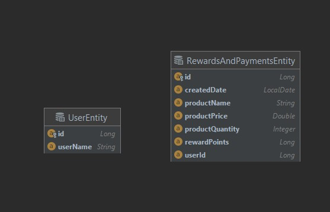
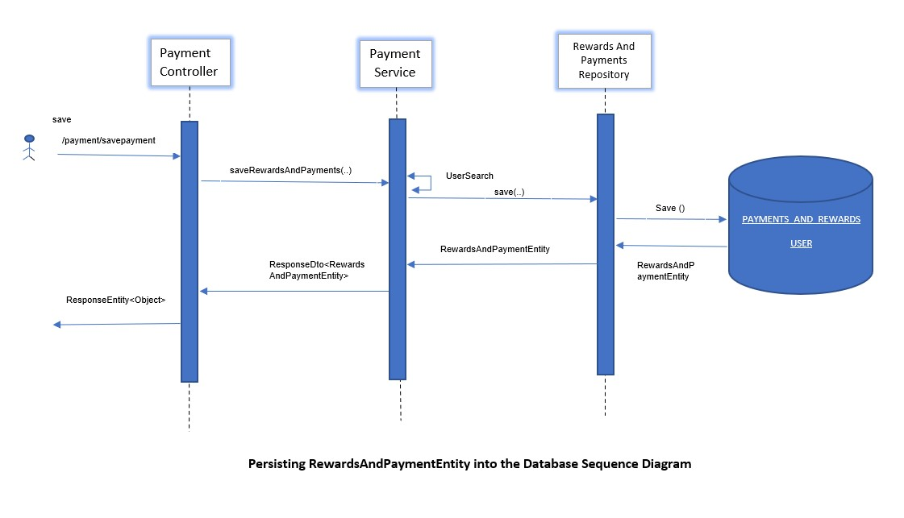
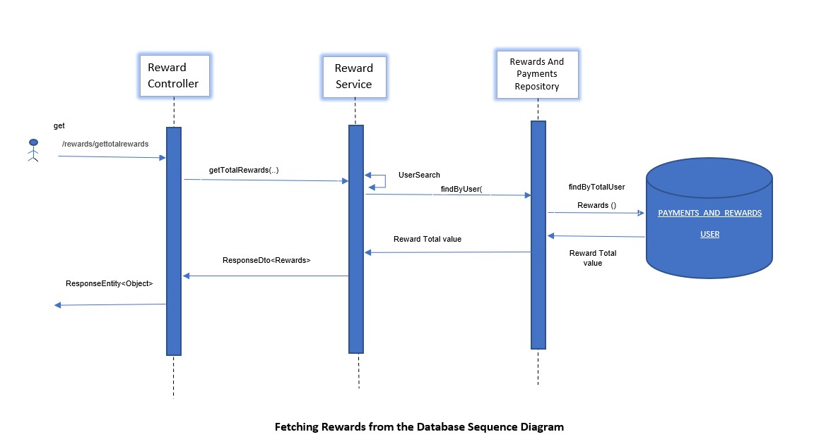

# Read Me First
The following project is created for ChatR interview demo purpose only:

* The Objective of this project is storing all payment transactions by calculating rewardPoints and persists for report purpose only.

# Getting Started
## Entity Diagram

## Persistence Sequence Diagram

## Retrieving Rewards Sequence Diagram

## Prerequisites
1. Maven setup in local machine
2. Intellij IDEA
3. Java 1.8
4. Any browser
5. Postman

## How to Download and set up the project

1. Download project zip file from [link](https://github.com/sureshrachamalli/telecom-test/archive/refs/heads/main.zip) into you local machine dev space
2. Unzip the project into dev space.
3. From IntelliJ open project.
4. All external dependency libraries will be downloaded.

## How to run project server
1. After `mvn clean install` run the application by `ChatrTestApplication.java` or by running command `mvn spring-boot:run` at terminal. 
2. Once application up and running please follow the below links for:
    * Import the [collection](Documents/postman/chatr-rewards-api.postman_collection.json) file from project directory to postman.
    * Please execute the [savepayment](http://localhost:8081/payment/savepayment) to save records into H2 DB. 
    * Try to execute for different combinations of products and units/price and so on. 
    * Now invoke the [getpayments](localhost:8081/payment/getpayments) with Request header `userName:xyz` and as a result will get as response.
3. For Retrieving Reward points Daily/Monthly/Quarterly basis please follow below links with `userName:xyz`.
    * For Daily earned Reward points [gettotalrewards](localhost:8081/rewards/gettotalrewards)
    * For Monthly earned Reward points [getmonthlyrewards](localhost:8081/rewards/getmonthlyrewards)
    * For Quarterly earned Reward points [getquarterlyRewards](localhost:8081/rewards/getquarterlyRewards)
4. Older than 3 months scheduled to purge every day in midnight.
5. In order run the all Integration and unit tests please run the command `mvn test`
6. Records can be observed from even H2 console. [H2 database console ](http://localhost:8081/h2)

##Other Technical Details
1. Exception Handling is done Global level. 
2. Validation has been implemented at request entry level with appropriate messages. 
3. Lombok has been implemented for logging and avoid unnecessary boilerplate code.
4. Swagger also can be watched during application up and running from [Swagger-ui.html](http://localhost:8081/swagger-ui/index.html#/)
5. Unit/Integration test cases has been implemented for each line of code.
6. The process execution sequence and table structure can be observed from starting of this document.

## References for Postman Collection/Swagger/H2/Actuator

*  [Potman Collection](Documents/postman/chatr-rewards-api.postman_collection.json) (Please follow the Root project directory)
* [Swagger-ui.html](http://localhost:8081/swagger-ui/index.html#/)
* [H2 database console ](http://localhost:8081/h2/login.do)
* [Actuator](http://localhost:8081/actuator)

